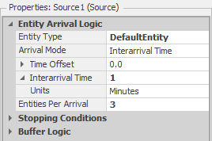

# Simio_FilasMercado
Experimento no Simio comparando: uma fila por caixa x fila única para todos os caixas.

O que é melhor? Cada caixa de supermercado ter uma fila independente x fila única para todos os caixas?

Sempre há vantagens e desvantagens.

Vamos considerar 3 caixas para cada exemplo, no primeiro cada caixa terá uma fila independente, no segundo será uma fila única e os clientes irão para o caixa conforme eles forem sendo liberados.
Ambos terão uma taxa de chegada de 3 clientes por minuto e cada caixa atende numa velocidade normal de 1min com desvio padrão de 0.8min.

Cenário 1 ( 1 fila para cada caixa):

 
Configurações do Source1:

 

Configurações para cada caixa:
 

Cenário 2 (1 fila para 3 caixas):

Nesse cenário foi necessário fazer uma simplificação, portanto será usado um caixa com capacidade de 3 clientes com a mesma velocidade de processo. 

 
Configuração do caixa (server4)
 

Após 24h de funcionamento, os resultados mostram que no cenário 1 o tempo médio de espera é:

Caixa	Tempo de espera(min)
Caixa1(server1):	11,34
Caixa2(server2):	29,42
Caixa3(server3):	8,41

Já para o cenário 2 para os mesmos parâmetros de chegada e de processo, o tempo de espera foi zero, dessa forma e possível concluir que o segundo modo é mais eficiente do que o primeiro.

Colocar contador para filas: 
Para adicionar o contador somente para a fila do processo é simples. Basta adicionar um “Status Label” e em “Expression” coloque “Nome.AllocationQueue”, dessa forma ele vai contar a quantidade de elementos na fila.
 

 
 
 
 Autores: Kelly Alves de Paula

Wagner Gurgel

Revisão: Arnaldo Gunzi

